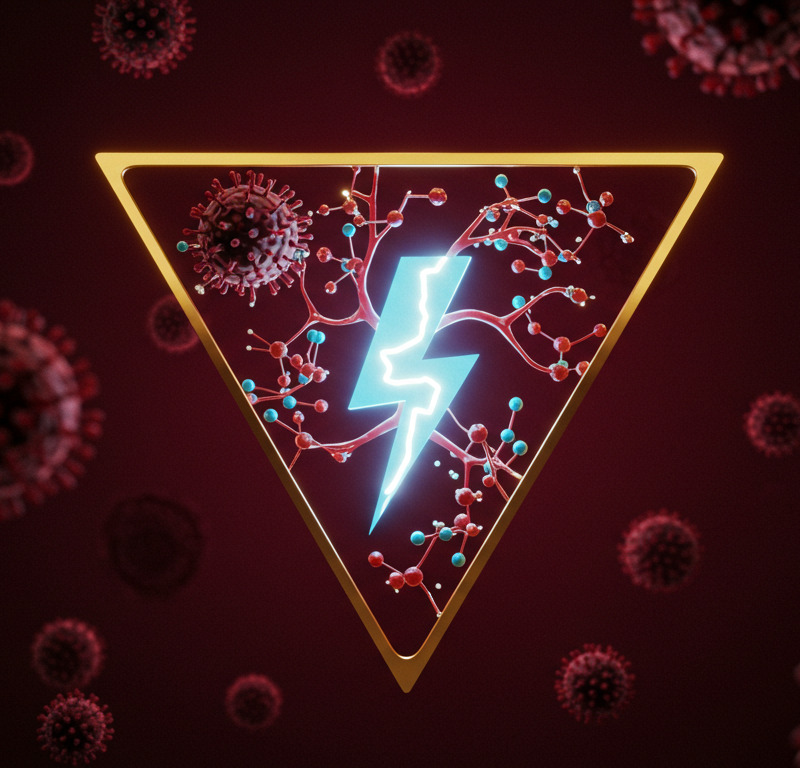
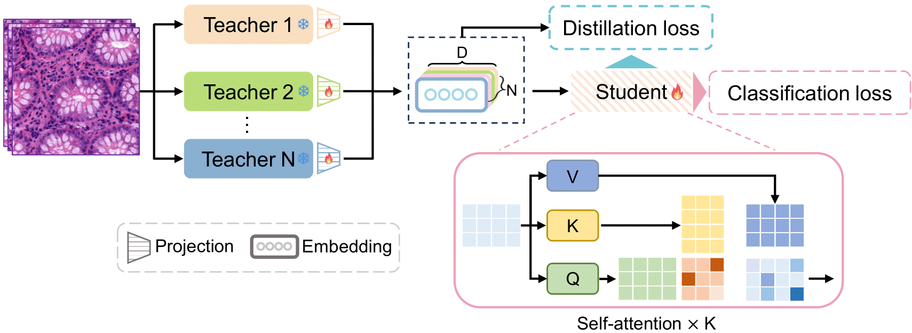

<p align="center">
  
</p>

<h2 align="center">Shazam</h2>

<p align="center">
  A lightweight model for feature knowledge distillation using histopathology foundational models.
</p>

---

## 📌 Project Overview

**Shazam** proposes a small and efficient model that distills knowledge from extracted features using histopathology foundational models. This approach effectively leverages the strong representational power of large-scale foundational models while optimizing computational efficiency through a lightweight distillation process.

### ✅ Key Highlights:

- **Feature Knowledge Distillation**  
  Transfers rich representations from foundational models into a smaller, more efficient model.

- **Lightweight and Scalable**  
  Achieves high accuracy with lower computational cost, suitable for practical deployment in clinical settings.

- **Superior Performance**  
  Outperforms existing CPath models and other fusion-based methods across multiple evaluation benchmarks.

---

## 📂 Project Structure



1. **Feature Extraction**: Leverages pretrained foundational histopathology models to extract high-level features from images.  
2. **Knowledge Distillation**: A small model learns to replicate the representational power of the foundational models.  
3. **Model Evaluation**: The distilled model is evaluated and compared against existing methods like CPath.

---


## ⚙️ Environment Setup

We directly use the environment configuration provided by the [**CLAM** project](https://github.com/mahmoodlab/CLAM).

### 1. Create the Conda Environment
```bash
conda env create -f env.yml
```

### 2. Activate the Environment
```bash
conda activate clam_latest
```


## 3. Train the Model
```bash
python train.py 
```


---

## Tutorial for Shazam

This section explains the **end-to-end tensor shape transformations** inside the `CrossAttentionClassifierWithDistillation` model.

### 🔢 Input Tensors

Each feature `.pt` file contains a tuple:
```python
(features, labels) = torch.load("xxx_features.pt")
```

- `features`: shape = `[N, C_i]`  
  where:
  - `N`: number of patches (WSIs)
  - `C_i`: feature dimension of model *i*, e.g., 1280 (Virchow), 1024 (Uni), etc.

- `labels`: shape = `[N]` (long, class indices)

During training:
```python
train_dataset = TensorDataset(*train_features_list, train_labels)
```
which means input to model:
```python
features = [x1, x2, x3, x4]   # x_i shape: [B, C_i]
```

---

### 🧠 Step 1: Feature Mapping

Each foundational model's features `x_i ∈ [B, C_i]` are mapped into a shared dimension `d_model`:

```python
Output shape: `[B, d_model]` for each modality
```
---

### 🧠 Step 2: Stack Features Across Modalities

After mapping:
```python
features_stacked = torch.stack([mapped_1, mapped_2, mapped_3, mapped_4], dim=1)
```

- Shape: `[B, 4, d_model]`  
  (treat each feature source as a token in attention)

---

### 🔁 Step 3: Self-Attention Layers

Each layer applies attention across the 4 modalities (tokens):

```python
Q, K, V: [B, 4, d_model] → Attention → Output: [B, 4, d_model]
```

Repeated `num_layers` times (e.g. 5).

---

### 🔄 Step 4: Feature Fusion

```python
fused_features = features.mean(dim=1)
```

- Shape: `[B, d_model]`  
  (aggregated representation for classification)

---

### 🎯 Step 5: Classifier

```python
fused_features → Linear → ReLU → LayerNorm → Linear → logits
```

- Output logits: `[B, num_classes]`

---

### 🧪 Step 6: Feature Distillation Loss

For distillation:
```python
student_features: [B, d_model]
expert_features_list: [B, C_i]  # for each i
mapped_expert = FeatureMapper(C_i → d_model)
```

- Compute cosine + Huber loss between `student_features` and each `mapped_expert`

---

### 🧾 Final Summary

| Stage                     | Shape                  | Description                                 |
|--------------------------|------------------------|---------------------------------------------|
| Raw Input                | `[B, C_i]`             | One per modality                            |
| After Mapping            | `[B, d_model] × 4`      | Standardized into shared dimension          |
| Stack (4 modalities)     | `[B, 4, d_model]`       | Cross-attention input                       |
| After Cross-Attention    | `[B, 4, d_model]`       | Contextually refined features               |
| Mean Fusion              | `[B, d_model]`          | Aggregated single representation            |
| Classifier Output        | `[B, num_classes]`      | Final prediction logits                     |
| Expert Mapping           | `[B, d_model]`          | Used in distillation loss                   |

---


